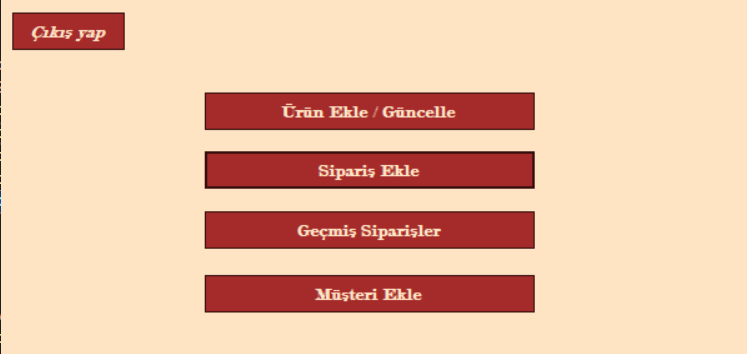
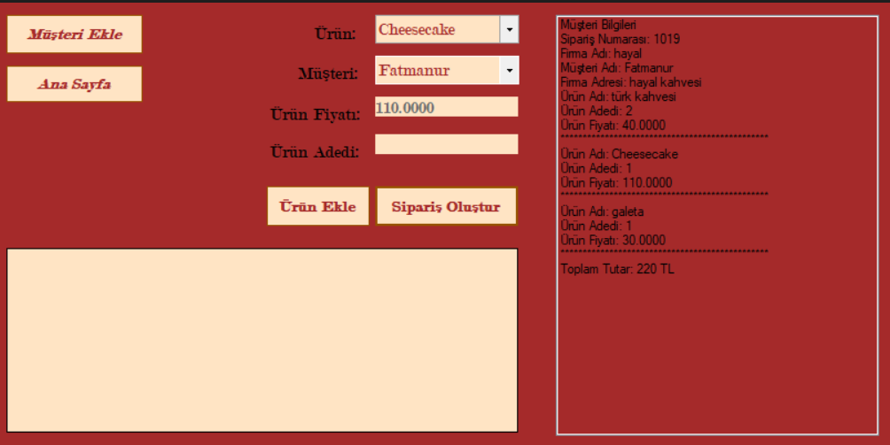
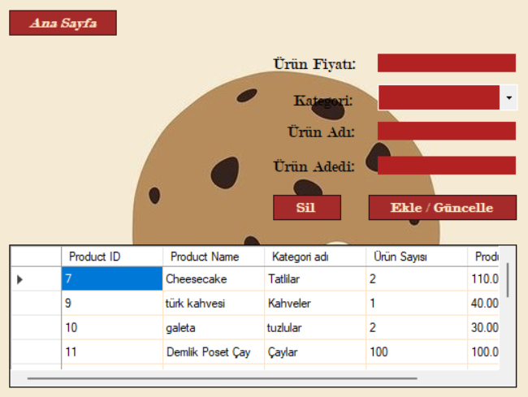

# Cafe Whole Saler Windows Form Uygulaması

Bu proje, bir **Cafe Whole Saler** yönetim sisteminin Windows Form ile geliştirilmiş bir versiyonudur. Proje, işletmelerin siparişlerini kolayca takip etmelerini, stoklarını yönetmelerini ve müşteri bilgilerini düzenlemelerini sağlar. Kullanıcı dostu bir arayüz ile geliştirilen bu uygulama, hızlı ve etkili bir çözüm sunar.

## Özellikler

- **Sipariş Yönetimi:** Yeni siparişler ekleyebilir, güncelleyebilir ve silebilirsiniz.
- **Stok Takibi:** Ürünlerin mevcut stok durumunu kolayca kontrol edebilirsiniz.
- **Müşteri Yönetimi:** Müşteri bilgilerini ekleyebilir ve düzenleyebilirsiniz.
- **Raporlama:** Satış raporlarını görüntüleyebilir ve analiz edebilirsiniz.
- **Kullanıcı Dostu Arayüz:** Basit ve kolay anlaşılır bir tasarım.

## Proje Videosu

Uygulamanın detaylı bir demosunu izlemek için aşağıdaki bağlantıya tıklayın:

> Videoyu doğrudan izlemek için [buraya tıklayın](https://www.youtube.com/watch?v=nfgtaVxWSCU).

## Ekran Görüntüleri

### Ana Ekran

### Sipariş Yönetimi

### Admin Girişi

### Ekle\Çıkar\Sil Yönetimi

